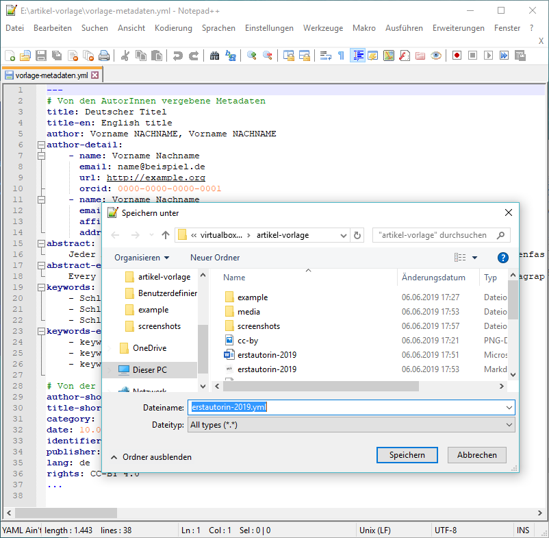
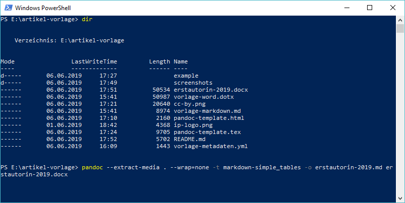
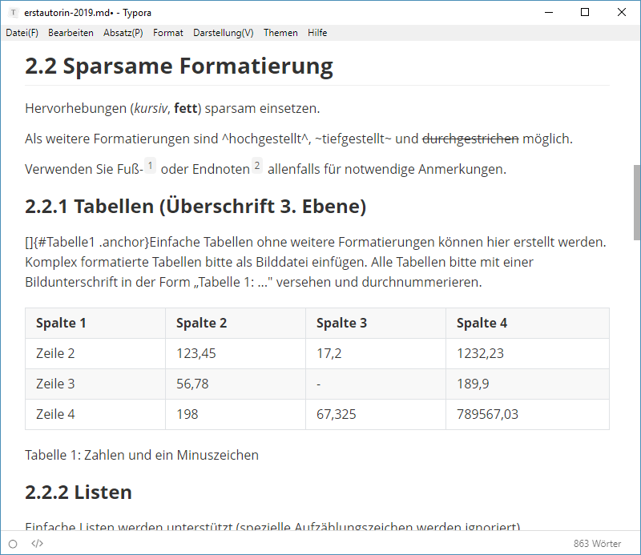
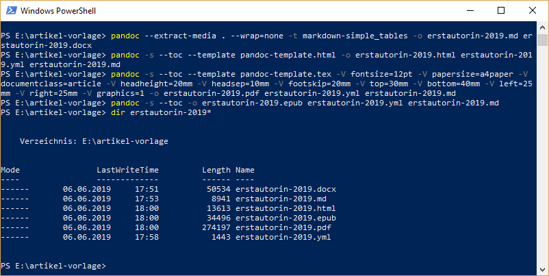

Dieses Repository enthält Vorlagen für Artikel der Fachzeitschrift [Informationspraxis](http://informationspraxis.de/) sowie Konfigurationsdateien zur Konvertierung der Artikel mit [Pandoc](https://pandoc.org) nach HTML, PDF und EPUB.

## Vorlage für Beitragseinreichungen

* [vorlage-word.dotx](vorlage-word.dotx) zum Verfassen mit Word
* [vorlage-markdown.md](vorlage-markdown.md) zum Verfassen in Markdown-Syntax
* vorlage-libreoffice.ott zum Verfassen mit Libre/Open Office
  - [ ] TODO: Vorlage für LibreOffice

## Redaktionsworkflow

Für die Konvertierung der eingereichten Artikel nach HTML, PDF und EPUB nutzen wir [Pandoc](https://pandoc.org/). Für die redaktionelle Bearbeitung nutzen wir den Markdown-Editor [Typora](https://typora.io). Beide Tools sind für Windows, macOS und Linux verfügbar. Unter Windows benötigen wir zusätzlich einen vernünftigen Texteditor zur Bearbeitung der Metadaten im YAML-Format wie z.B. Notepad++.

### Beispiel

- AutorInnen
  - Einreichung nach Word-Vorlage: [example/erstautorin-2019.docx](example/erstautorin-2019.docx)
- Redaktion
  - Metadaten in YAML erfassen: [example/erstautorin-2019.yaml](example/erstautorin-2019.yaml)
  - Markdown aus DOCX generiert und nachbearbeitet: [example/erstautorin-2019.yaml](example/erstautorin-2019.yaml)
- Pandoc
  - HTML: [example/erstautorin-2019.html](example/erstautorin-2019.html)
  - PDF: [example/erstautorin-2019.pdf](example/erstautorin-2019.pdf)
  - EPUB: [example/erstautorin-2019.epub](example/erstautorin-2019.epub)

### Installation

Windows, MacOS, Linux:

* Pandoc installieren: https://pandoc.org/installing.html
  * Pandoc benötigt LaTeX, siehe dazu den letzten Punkt der Pandoc Installationsanweisung.
  * Unter Windows wird beispielsweise die (zusätzliche) Installation von [MiKTeX](https://miktex.org/howto/install-miktex) empfohlen.
* Markdown-Editor Typora installieren: https://typora.io/#download
* Vorlagen herunterladen: https://github.com/felixlohmeier/artikel-vorlage/archive/master.zip

Windows zusätzlich:

* Notepad++ installieren: https://notepad-plus-plus.org/download/

### Redaktionelle Bearbeitung

Der folgende Workflow wurde getestet am 6.6.2019 unter Windows mit:

* Pandoc 2.7.2
* MiKTeX 2.9.7086
* Typora 0.9.70
* Notepad++ 7.7

#### Schritt 1: Erstellung einer YAML-Datei für die Metadaten

Vorlagendatei `vorlage-metadaten.yml` in einem UTF-8-fähigen-Texteditor (z.B. Notepad++ unter Windows) öffnen, alle relevanten Daten ausfüllen und unter neuem Dateinamen speichern, hier im Beispiel  `erstautorin-2019.yml`.

Der Abschnitt "von den AutorInnen vergebene Metadaten" kann ggf. per Copy & Paste aus dem von den AutorInnen eingereichten Dokument übernommen werden.



#### Schritt 2: Konvertierung des eingereichten Dokuments nach Markdown

Öffnen Sie eine Kommandozeile (Windows: PowerShell, macOS/Linux: Terminal) und wechseln Sie in das Verzeichnis, in das Sie die Vorlagen heruntergeladen haben.

Legen Sie das eingereichte Dokument ebenfalls in diesem Verzeichnis ab. In diesem Beispiel heißt die Quelldatei `erstautorin-2019.docx`



* von Format Markdown
  * keine Konvertierung notwendig, weiter mit Schritt 3
* von Format DOC
  * Datei in Word oder LibreOffice öffnen und als DOCX speichern
  * Dann weiter mit Format DOCX

- von Format DOCX (Beispiel für Quelldatei `erstautorin-2019.docx`)

```
pandoc --extract-media . --wrap=none -t markdown-simple_tables -o erstautorin-2019.md erstautorin-2019.docx
```

- von Format ODT (Beispiel für Quelldatei `erstautorin-2019.odt`)

```
pandoc --extract-media . --wrap=none -t markdown-simple_tables -o erstautorin-2019.md erstautorin-2019.odt
```

#### Schritt 3: Nachbearbeitung der Markdown-Datei

Die im vorigen Schritt erstellte Markdown-Datei in einem Markdown-Editor (z.B. Typora unter Windows) öffnen und bereinigen.



Folgende Nacharbeiten sind erforderlich:

* Metadaten und Fragmente aus der Vorlage zu Beginn der Datei löschen. Der Text muss direkt mit der ersten Überschrift (z.B. `1 Einleitung`) beginnen.
* Prüfen, ob alle Bilder korrekt angezeigt werden. Größenangaben wie `{width="6.531496062992126in" height="2.263779527559055in"}` löschen.
* Bildunterschriften prüfen und ggf. vereinheitlichen.
* Wenn Listen kompakt dargestellt werden sollen, dann im Quellcode (Menü Darstellung / Quellcodemodus) leere Zeilen innerhalb der Aufzählungen entfernen.
* Ggf. weitere Formatierung gemäß der [Richtlinien](https://journals.ub.uni-heidelberg.de/index.php/ip/about/submissions) und nach [Pandoc-Markdown-Syntax](http://pandoc.org/MANUAL.html#pandocs-markdown)

### HTML, PDF und EPUB generieren

Zurück in der Kommandozeile die folgenden Befehle aufrufen, um die fertigen Dateien für OJS zu erstellen.



#### Schritt 4: Erstellung der HTML-Version

```
pandoc -s --toc --template pandoc-template.html -o erstautorin-2019.html erstautorin-2019.yml erstautorin-2019.md
```

Manuelle Nacharbeiten:

* Mit Suchen & Ersetzen die Pfadangabe für Bilddateien anpassen, da OJS direkte Links auf Dateinamen der Bilddateien erwartet
  * Suchen: `img src="./media/`
  * Ersetzen: `img src="`

#### Schritt 5: Erstellung der PDF-Version

```
pandoc -s --toc --template pandoc-template.tex -V fontsize=12pt -V papersize=a4paper -V documentclass=article -V headheight=20mm -V headsep=10mm -V footskip=20mm -V top=30mm -V bottom=40mm -V left=25mm -V right=25mm -V graphics=1 -o erstautorin-2019.pdf erstautorin-2019.yml erstautorin-2019.md
```

#### Schritt 6: Erstellung der EPUB-Version

```
pandoc -s --toc -o erstautorin-2019.epub erstautorin-2019.yml erstautorin-2019.md
```

