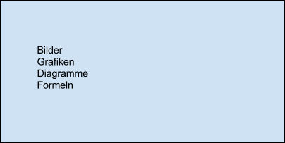

Einleitung
----------------------

Diese Vorlage ist **nicht aktuell** und dient lediglich als Platzhalter!

Text hier. Und hier ist ein in eigenen Worten wiedergegebenes Zitat.
(vgl. AutorIn & AutorIn, 2009). Text hier. Text hier. Text hier. Pro
Kapitel mind. eine halbe Seite. Text hier. Text hier.

<!---->

Abb. 1: Titel Abbildung 1 (normale Option)

Siehe [Einleitung](#einleitung)

2 Überschrift 1. Ebene {.c0 .c19}
----------------------

Text hier. Text hier. Text hier. “Ein wörtliches Zitat soll sehr sparsam
eingesetzt werden.” (NAME, Name & NAME, 2014) Text hier. Text hier. Text
hier. Text hier.1

<!---->

Abb. 2: Titel Abbildung 2 (Option für breite Abbildungen)

Text hier. Text hier. Text hier. Text hier. Text hier. Text hier. Text
hier. Text hier. Text hier. Text hier. Text hier. Text hier. Text hier.
Text hier. Text hier. Text hier. Text hier. Text hier. Text hier. Text
hier. Text hier. Text hier. Text hier. Text hier. Text hier. Text hier.
Text hier. Text hier. Text hier. Text hier.

### 2.1 Überschrift 2. Ebene {.c0 .c22}

Text hier. Text hier. Text hier. Text hier. Text hier. Text hier. Text
hier. Text hier. Text hier. Text hier. Text hier. Text hier. Text hier.
Text hier. Text hier.Text hier. Text hier. Text hier. Text hier. Text
hier. Text hier. Text hier. Text hier. Text hier. Text hier. Text hier.
Text hier. Text hier. Text hier. Text hier.^[Eine Fußnote. So wenige wie
möglich verwenden]

### 2.2 Überschrift 2. Ebene {.c0 .c22}

Text hier. Text hier. Hervorhebungen sparsamund immer nur kursiv
einsetzen. Text hier. Text hier. Text hier. Text hier. Text hier. Text
hier. Text hier. Text hier.Text hier. Text hier. Text hier. Text hier.
Text hier. Text hier.^[Leider funktionieren bei Google keine Endnoten, aber
das wäre unsere Empfehlung für die eingereichten Artikel]
Verwenden Sie nicht die
automatisierten Aufzählungen Ihres Textprogrammes. Aufzählungszeichen
Minus Leerzeichen Text der Aufzählung.\

- Liste

- Liste

- Liste

Text hier. Text hier. Text hier. Text hier. Text hier. Text hier. Text
hier. Text hier. Text hier. Text hier. Text hier. Text hier. Text hier.
Text hier. Text hier.Text hier. Text hier. Text hier. Text hier. Text
hier. Text hier.

+--------------------+--------------------+--------------------+--------------------+
| Spalte 1           | Spalte 2           | Spalte 3           | Spalte 4           |
+--------------------+--------------------+--------------------+--------------------+
| Zeile 2            | 123,45             | 17,2               | 1232,23            |
+--------------------+--------------------+--------------------+--------------------+
| Zeile 3            | 56,78              | -                  | 189,9              |
+--------------------+--------------------+--------------------+--------------------+
| Zeile 4            | 198                | 67,325             | 789567,03          |
+--------------------+--------------------+--------------------+--------------------+

:Wahllos eingegebene Zahlen und ein Minuszeichen

#### 2.2.1 Überschrift 3. Ebene {.c0 .c16}

Text hier. Text hier. Text hier. Text hier. Text hier. Text hier. Text
hier. Text hier. Text hier. Text hier. Text hier. Text hier. Text hier.
Text hier. Text hier.Text hier. Text hier. Text hier. Text hier. Text
hier. Text hier. Verwenden Sie nicht die automatisierten nummerierten
Listen Ihres Textprogrammes.

1.Nummerierte Liste

2.Nummerierte Liste

3.Nummerierte Liste

#### 2.2.2 Überschrift 3. Ebene {.c0 .c16}

Text hier. Text hier. Text hier. Text hier. Text hier. Text hier. Text
hier. Text hier. Text hier. Text hier. Text hier. Text hier. Text hier.
Text hier. Text hier.Text hier. Text hier. Text hier. Text hier. Text
hier. Text hier.

#### 2.2.2.1 Überschrift 4. Ebene {.c0 .c16}

Text hier. Text hier. Text hier. Text hier. Text hier. Text hier. Text
hier. Text hier. Text hier. Text hier. Text hier. Text hier. Text hier.
Text hier. Text hier.Text hier. Text hier. Text hier. Text hier. Text
hier. Text hier.^[[a]](#cmnt1)^

3 Quellen {.c0 .c19}
---------

Nachname, Vorname (xx. Jan. 2012): Titel: Untertitel[online]. Zugriff
am: 10. Aug. 2014]. Verfügbar unter:
http://www.adresse.de/titel/name\_name\_titel\_name/

Nachname, Vorname (2009): Titel des unselbständigen Werkes. In:
Nachname, Vorname und Nachname, Vorname, Hg.: Der Titel des
selbständigen Titels. Ort: Verlag, S. von-bis

Nachname, Vorname Vorn. (2013): Titel: Untertitel. Ort: Verlag.

Nachname, Vorname, Nachname, Vorname & Nachname, Vorname (2010). Titel
des Artikels. In: Titel des Journals109, 2, S. 16–26. [Zugriff am 10.
Aug. 2014]. DOI: http://dx.doi.org/10.2403/jo.nam.2010.07.008.

